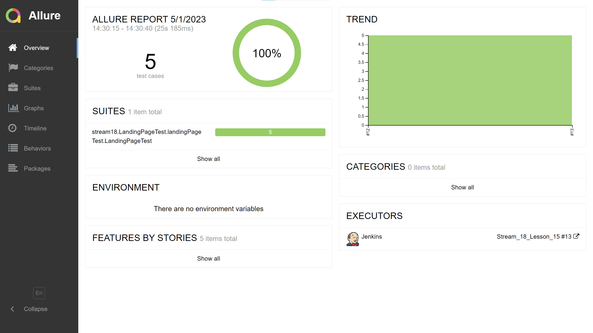
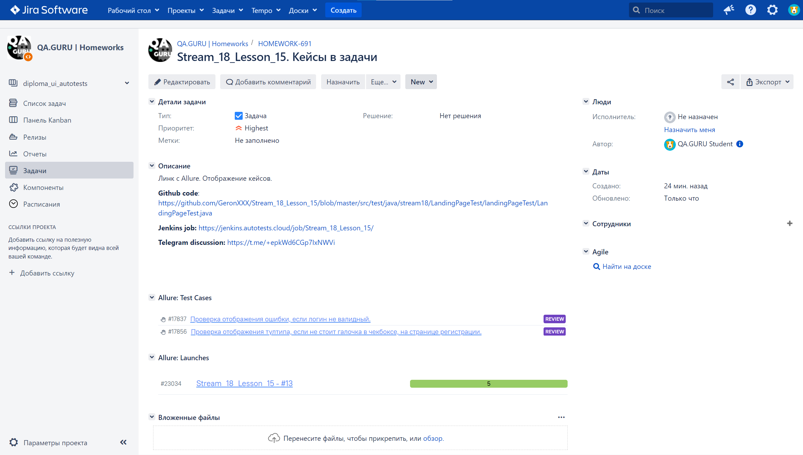
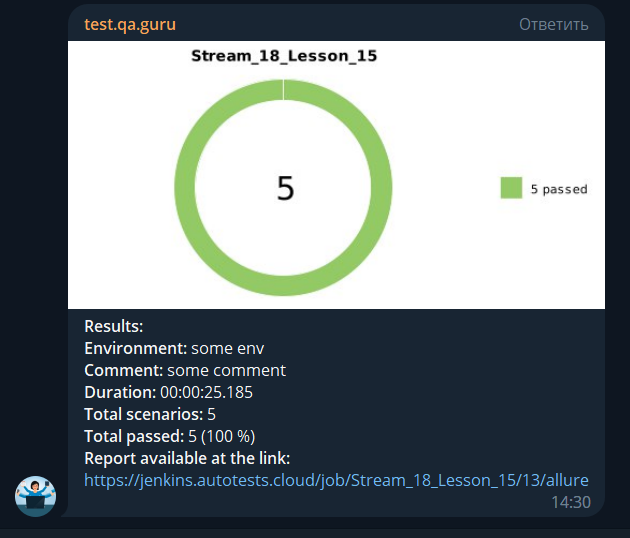

# Проект по автоматизации тестовых сценариев для лендинга сайта компании 1OFD.
## :scroll: Содержание:

- [Используемый стек](#computer-используемый-стек)
- [Запуск автотестов](#arrow_forward-запуск-автотестов)
- [Сборка в Jenkins](#-сборка-в-jenkins)
- [Пример Allure-отчета](#-пример-allure-отчета)
- [Интеграция с Allure TestOps](#-интеграция-с-allure-testOps)
- [Интеграция с Jira](#-интеграция-с-jira)
- [Уведомления в Telegram](#-уведомления-в-telegram-с-использованием-бота)
- [Видео примера запуска тестов в Selenoid](#-видео-примера-запуска-тестов-в-Selenoid)

## :computer: Используемый стек

<p align="center">


 

</p>

Тесты в данном проекте написаны на языке <code>Java</code>, сборщик - <code>Gradle</code>. Так же были использованы фреймворки <code>JUnit 5</code> и [Selenide](https://selenide.org/).
При прогоне тестов браузер запускается не локально, а в [Selenoid](https://aerokube.com/selenoid/).
Для удаленного запуска реализована джоба в <code>Jenkins</code> с формированием Allure-отчета и отправкой результатов в <code>Telegram</code> при помощи бота. Так же реализована интеграция с <code>Allure TestOps</code> и <code>Jira</code>

Содержание Allure-отчета:
* Шаги теста;
* Скриншот страницы на последнем шаге;
* Page Source;
* Логи браузерной консоли;
* Видео выполнения автотеста.

## :arrow_forward: Запуск автотестов

### Запуск тестов из терминала
```
gradle clean ofd_tests_test
```
При выполнении данной команды в терминале IDE тесты запустятся удаленно в <code>Selenoid</code>. 

### Установленная конфигурация

* Браузер - <code>chrome</code>;
* Версия браузера - <code>100.0</code>;
* Расширение окна браузера - <code>1920x1080</code>.


##  Сборка в Jenkins
<p align="center">

</p>

##  Пример Allure-отчета
### Overview

<p align="center">

</p>

##  Интеграция с Allure TestOps

Выполнена интеграция сборки <code>Jenkins</code> с <code>Allure TestOps</code>, так при каждом запуске автотестов результаты можно посмотреть в приложении. 
На Dashboard в <code>Allure TestOps</code> видна статистика сколько всего тестов, сколько из них добавлены и проходятся вручную, а сколько автоматизированы. Новые тесты, а так же результаты прогона приходят по интеграции при каждом запуске сборки.

<p align="center">

</p>

### Результат выполнения автотеста

<p align="center">

</p>

##  Интеграция с Jira

Реализована интеграция <code>Allure TestOps</code> с <code>Jira</code>, таким образом, что в тикете можно посмотреть какие тест-кейсы были написаны в рамках задачи и результат их прогона.

<p align="center">

</p>


###  Уведомления в Telegram с использованием бота

После завершения сборки специальный бот, созданный в <code>Telegram</code>, автоматически обрабатывает и отправляет сообщение с результатом.

<p align="center">

</p>

###  Видео примера запуска тестов в Selenoid

К каждому тесту в отчете прилагается видео прогона.
<p align="center">
  
</p>
